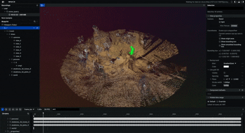
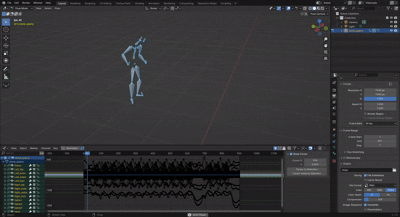

<div align="center">
    <a href="https://github.com/liris-xr/kineo">
      
    </a>
</div>
<p align="center">
    Charles Javerliat, Pierre Raimbaud, Guillaume Lavoué
    <br />
    <a href="https://liris-xr.github.io/kineo/"><strong>🌐 Project Page »</strong></a>&emsp;
    <a href="https://arxiv.org/abs/2510.24464"><strong>📄Paper »</strong></a>&emsp;
    <br />
</p>

Kineo is a calibration-free metric motion capture system that reconstructs 3D motion from sparse RGB cameras. It leverages existing 2D keypoints detectors to estimate 3D poses without requiring complex calibration procedures, making motion capture more accessible and flexible.

<div align="center">
    
</div>

## ⚡Quick Install

Kineo uses Pixi for environment management. Install pixi [here](https://pixi.prefix.dev/latest/installation/).

Once Pixi is available, install the environment with:
```sh
pixi install
```

## 🚀 How to use

Kineo provides two processing modes: offline and online. The offline mode is the primary mode, designed for unconstrained, real-world video capture, delivering high reconstruction accuracy and supporting long sequences without on-site calibration. The online mode enables real-time processing of live video streams, offering immediate feedback for interactive applications.

### Prerequisites

Download the required model checkpoints:
```sh
pixi run download-checkpoints
```
You will be prompted to provide SMPL and SMPL-X credentials.

### Offline

In offline mode, Kineo uses the full video sequence to produce high-accuracy calibration of camera parameters and 3D motion reconstructions. This mode can be used on any video by running the following command:

```sh
pixi run kineo-offline --sequence-name stone_quarry --batch-size 16 --target-fps 50 --shared-intrinsics ./assets/stone_quarry/
```

A window will appear prompting you to select the person to track. Once selected, you can use the slider to verify that the track remains accurate throughout the video. When you press Continue, a new window will open for the next view, and this process repeats until the person has been selected in all views.

<div align="center" style="display: flex; justify-content: center; gap: 10px;">
    
    
    
</div>

This step relies on our [custom fork of SAM2](https://github.com/cjaverliat/sam2) to run without requiring the entire video to be loaded into RAM or VRAM (which led to OOM in the original implementation), to define custom memory/forgetting strategies and to use EfficientTAM for faster inference.

The pipeline will output results in the `outputs/infer_nlf_single_person_sam2/offline_demo/` folder, including all generated annotations in `.pkl` format (e.g. bboxes, camera parameters, 3D keypoints, etc.), a `.rrd` rerun file that can be visualized with [Rerun](https://www.rerun.io/), along with a `.bvh` file that can be imported in Blender, Maya, Unity, Unreal Engine, etc.

<div align="center" style="display: flex; justify-content: center; flex-direction: column;">
    
    <p><i>Rerun visualization of the reconstructed motion from multiple views.</i></p>
</div>

<div align="center" style="display: flex; justify-content: center; flex-direction: column;">
    
    <p><i>3D motion imported into Blender via BVH format for animation or analysis.</i></p>
</div>

### Online

In online mode, Kineo first performs a short calibration sequence to estimate the camera parameters. After this initial step, the video streams are processed in real time to produce the 3D output. By default, the program uses all available webcams.

```sh
pixi run kineo-online
```

## 📊 Evaluation

Kineo sets a new state-of-the-art on EgoHumans and Human3.6M, reducing camera translation error by ~83–85%, camera angular error by ~86–92%, and world mean-per-joint error (W-MPJPE) by ~83–91% compared to prior methods, while efficiently handling multi-view sequences.

To reproduce our results, download, preprocess then benchmark on the datasets using the provided commands:
```sh
# For H3.65M
pixi run h36m-download <path-to-h36m-dataset>
pixi run h36m-preprocess <path-to-h36m-dataset>
pixi run h36m-benchmark <path-to-h36m-dataset> [path-to-config.yaml]

# For EgoHumans
pixi run egohumans-download <path-to-egohumans-dataset>
pixi run egohumans-preprocess <path-to-egohumans-dataset>
pixi run egohumans-benchmark <path-to-egohumans-dataset> [path-to-config.yaml]
```

If no `path-to-config.yaml` is not given, uses `configs/experiments/benchmarks/*_benchmark_nlf_estRt_estK_estD.yaml` by default.
All configurations used in the paper are available in the `configs` directory.

## 👁️ Previewing a dataset

Check a preprocessed sequence and its ground truth in [rerun](https://rerun.io):
3D skeletons and cameras, 2D skeletons and boxes over the footage, and a lane
per view showing when it was recording and which part is annotated.

```sh
export KINEO_DATASETS_DIR=<path-to-datasets>   # parent of AIST++, H3.6M, EgoHumans

pixi run preview-egohumans tennis_001
pixi run preview-aistpp mBR2_ch01
pixi run preview-h36m S9_Directions
```

A sequence is picked by name, or by any fragment naming exactly one.

```sh
pixi run preview-aistpp mBR2_ch01 refined       # AIST++ variant: raw or refined
pixi run preview-h36m "S1_Directions 1" train   # H3.6M split: val or train
```

## 🤝 Contributing

The pipeline is modular and can easily be extended by changing the stages defined in the configuration files. Example of configuration files are available in the `configs` directory. If you want to integrate your own work in Kineo, feel free to fork the repository and modify the code to suit your needs.

## 🙏 Acknowledgments

This work was supported by the Auvergne-Rhône-Alpes region as part of the PROMESS project. This work was granted access to the HPC resources of IDRIS under the allocation 2025-AD010614830 made by GENCI. We also express our gratitude to the Guédelon Castle for kindly welcoming us and permitting the captures that were essential to this study.

## 📜 License

Kineo is distributed under a non-commercial research license. The full terms are available in the [LICENSE file](LICENSE.md).
For commercial use, please contact us at guillaume.lavoue@enise.ec-lyon.fr.

## 📚 BibTeX

```
@article{javerliat2025kineo,
  title={Kineo: Calibration-Free Metric Motion Capture From Sparse RGB Cameras}, 
  author={Charles Javerliat and Pierre Raimbaud and Guillaume Lavoué},
  year={2025},
  eprint={2510.24464},
  archivePrefix={arXiv},
  primaryClass={cs.CV},
  url={https://arxiv.org/abs/2510.24464}, 
}
```