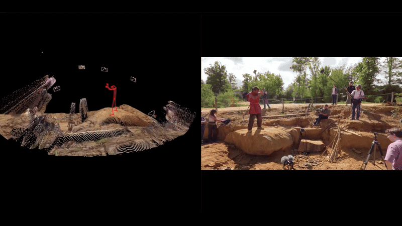
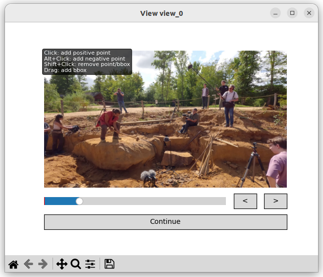
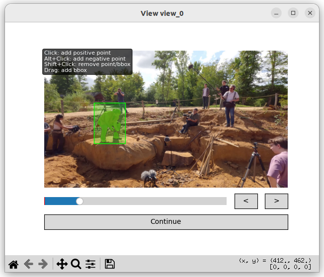
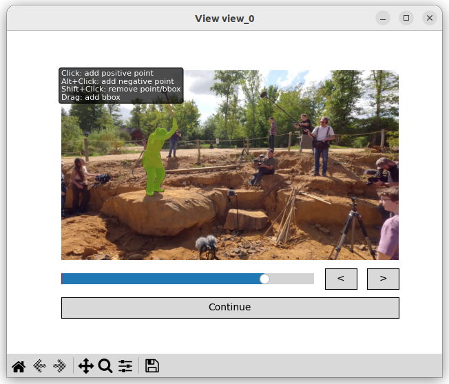

<div align="center">
    <a href="https://github.com/liris-xr/kineo">
      
    </a>
</div>
<p align="center">
    Charles Javerliat, Pierre Raimbaud, Guillaume Lavoué
    <br />
    <a href="https://liris-xr.github.io/kineo/"><strong>🌐 Project Page »</strong></a>&emsp;
    <a href="https://arxiv.org/abs/2510.24464"><strong>📄Paper »</strong></a>&emsp;
    <br />
</p>

Kineo is a calibration-free metric motion capture system that reconstructs 3D motion from sparse RGB cameras. It leverages existing 2D keypoints detectors to estimate 3D poses without requiring complex calibration procedures, making motion capture more accessible and flexible.

<div align="center">
    
</div>

## ⚡Quick Install

Kineo requires `python>=3.10` and `torch>=2.6.0`:

```sh
conda create -n kineo python=3.10
pip3 install torch torchvision --index-url https://download.pytorch.org/whl/cu126
git clone https://github.com/liris-xr/kineo.git && cd kineo
pip install -e .
```

## 🚀 How to use

Kineo provides two processing modes: offline and online. The offline mode is the primary mode, designed for unconstrained, real-world video capture, delivering high reconstruction accuracy and supporting long sequences without on-site calibration. The online mode enables real-time processing of live video streams, offering immediate feedback for interactive applications.

### Offline

In offline mode, Kineo uses the full video sequence to produce high-accuracy calibration of camera parameters and 3D motion reconstructions. This mode can be used on any video by running the following command:

```sh
kineo-offline --sequence-name stone_quarry --batch-size 16 --target-fps 50 --shared-intrinsics \
./assets/stone_quarry_1.mp4 \
./assets/stone_quarry_2.mp4 \
./assets/stone_quarry_3.mp4 \
./assets/stone_quarry_4.mp4 \
./assets/stone_quarry_5.mp4 \
./assets/stone_quarry_6.mp4
```

A window will appear prompting you to select the person to track. Once selected, you can use the slider to verify that the track remains accurate throughout the video. When you press Continue, a new window will open for the next view, and this process repeats until the person has been selected in all views.

<div align="center" style="display: flex; justify-content: center; gap: 10px;">
    
    
    
</div>

This step relies on our [custom fork of SAM2](https://github.com/cjaverliat/sam2) to run without requiring the entire video to be loaded into RAM or VRAM (which led to OOM in the original implementation), to define custom memory/forgetting strategies and to use EfficientTAM for faster inference.

### Online

In online mode, Kineo first performs a short calibration sequence to estimate the camera parameters. After this initial step, the video streams are processed in real time to produce the 3D output. By default, the program uses all available webcams.

```sh
kineo-online
```

## 📊 Evaluation

Kineo sets a new state-of-the-art on EgoHumans and Human3.6M, reducing camera translation error by ~83–85%, camera angular error by ~86–92%, and world mean-per-joint error (W-MPJPE) by ~83–91% compared to prior methods, while efficiently handling multi-view sequences.

To reproduce the results presented in the paper, please refer to the [evaluation](./EVALUATION.md) instructions.

## 🙏 Acknowledgments

This work was supported by the Auvergne-Rhône-Alpes region as part of the PROMESS project. This work was granted access to the HPC resources of IDRIS under the allocation 2025-AD010614830 made by GENCI. We also express our gratitude to the Guédelon Castle for kindly welcoming us and permitting the captures that were essential to this study.

## 📚 BibTeX

```
@article{javerliat2025kineo,
  title={Kineo: Calibration-Free Metric Motion Capture From Sparse RGB Cameras}, 
  author={Charles Javerliat and Pierre Raimbaud and Guillaume Lavoué},
  year={2025},
  eprint={2510.24464},
  archivePrefix={arXiv},
  primaryClass={cs.CV},
  url={https://arxiv.org/abs/2510.24464}, 
}
```